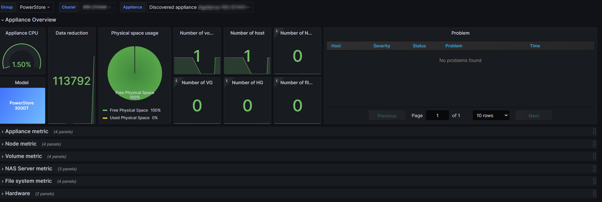
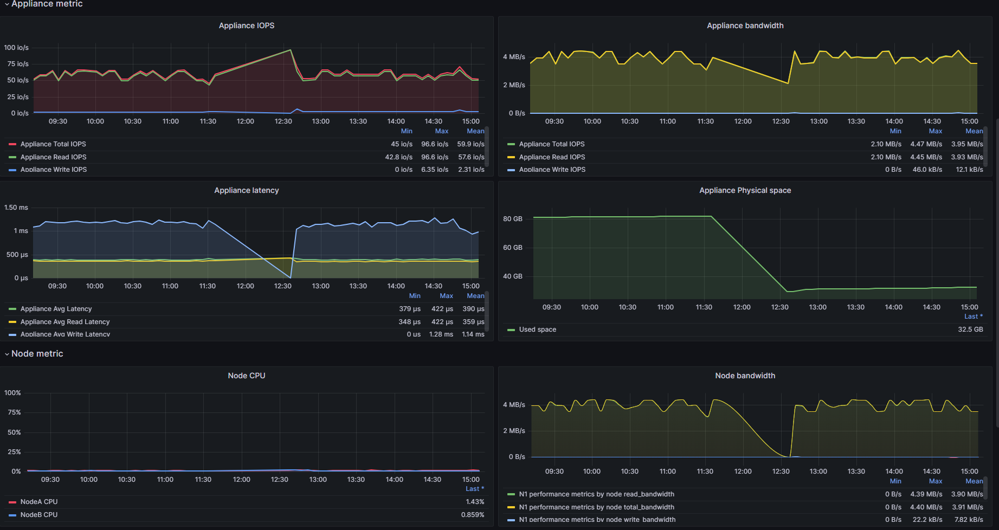
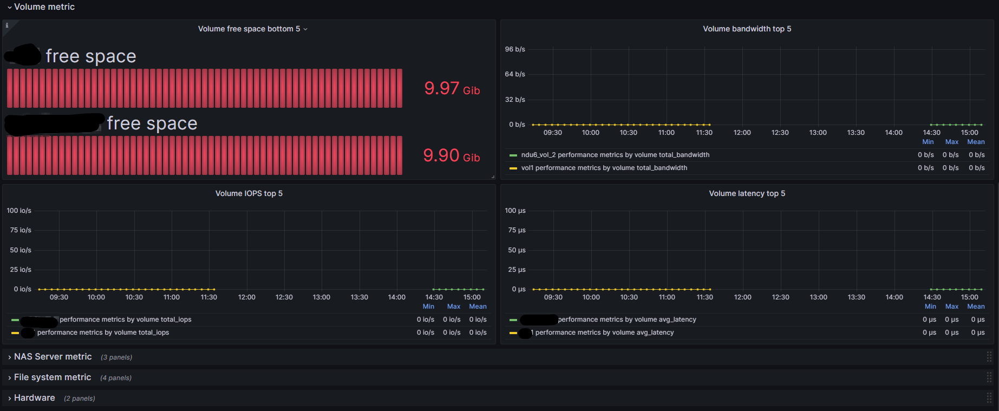

# Zabbix PowerStore Template

A Zabbix template to monitor DellEMC PowerStore Storage via PowerStore REST API.

## How to use it

1. Import zabbix template "[zabbix_powerstore_template.yaml](zabbix_powerstore_template.yaml)"

    Zabbix GUI -> Configuration -> Templates -> Import -> "Upload the template"

2. Create a new host (act as the PowerStore Cluster) with template "**Template PowerStore Cluster**"

    Zabbix GUI -> Configuration -> Hosts -> Create host

3. Edit Macros, configure PowerStore REST API.

    - {$API_USERNAME}
    - {$API_PASSWORD}
    - {$API_URL}

# Zabbix Grafana PowerStore dashboard

A Zabbix Grafana dashboard for DellEMC PowerStore.

## How to use it

1. Install Zabbix plugin in Grafana

    Grafana GUI -> Configuration -> Plugins -> Search and install Zabbix

2. After install, add Zabbix Datasource in Grafana

    Grafana GUI -> Configuration -> Data sources -> Add new add data source -> Zabbix

3. Configure Zabbix datasource

4. Import Dashbord "[grafana_powerstore_template.json](grafana_powerstore_template.json)"

# Requirement

- Zabbix 6.2 +
- Grafana 9.4 +

# Demo

